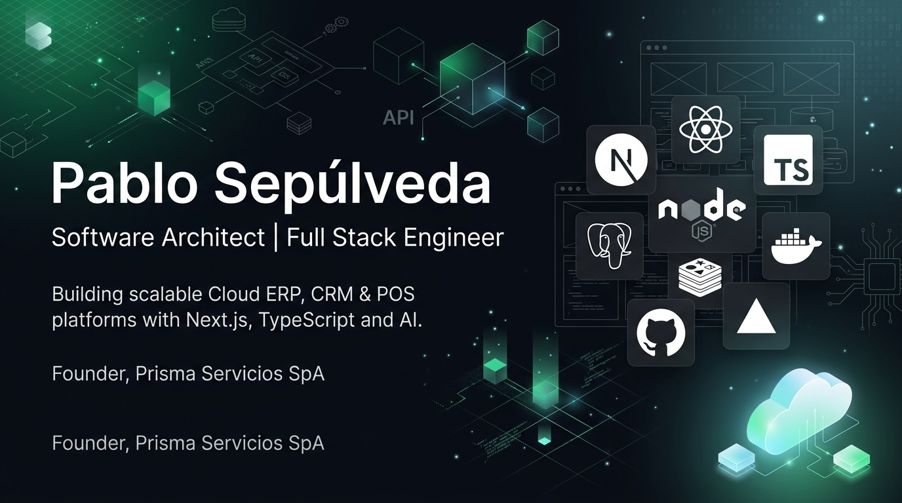

  

# 👋 Hi, I'm Pablo Sepúlveda

### Software Architect • Full Stack Engineer • Computer Engineer • MBA

Building scalable cloud software for the next generation of businesses.

**Founder @ Prisma Servicios SpA**

---

---

# 🚀 About Me

I am a Software Architect and Full Stack Engineer with more than **20 years of experience** designing enterprise software, leading digital transformation initiatives, and building scalable cloud-native applications.

Throughout my career, I have worked across software engineering, technology leadership, public administration, and business process optimization.

Today I focus on designing modern SaaS platforms using **Next.js**, **TypeScript**, **tRPC**, **Drizzle ORM**, and **PostgreSQL**, following Domain-Driven Design and Clean Architecture principles.

My mission is simple:

> Build software that solves real business problems while remaining elegant, maintainable, and scalable.

---

# 🏗 Current Project

# PrismaGo

Cloud ERP + POS Platform for Small and Medium Businesses

PrismaGo is a modern cloud-native platform built from the ground up using the latest web technologies.

### Current Modules

- Point of Sale (POS)
- ERP
- CRM
- Purchasing
- Inventory
- Electronic Invoicing
- Customers
- Suppliers
- Dashboards
- Business Intelligence
- Multi-Tenant SaaS

---

# 💻 Technology Stack

## Frontend

- Next.js 16
- React 19
- TypeScript
- Tailwind CSS v4
- shadcn/ui

## Backend

- Node.js
- tRPC
- Drizzle ORM
- PostgreSQL
- Redis

## Cloud

- Vercel
- Neon
- Docker
- GitHub Actions

## Architecture

- Domain Driven Design (DDD)
- Clean Architecture
- Modular Monolith
- API First
- Event Driven Design
- Multi-Tenant SaaS
- SOLID Principles
- Vertical Slice Architecture

---

# ⭐ Core Expertise

- Software Architecture
- Enterprise Software
- SaaS Platforms
- ERP Systems
- POS Systems
- Cloud Computing
- Full Stack Development
- API Design
- Database Design
- Performance Optimization
- Digital Transformation
- Technical Leadership
- AI-Assisted Development

---

# 📂 Featured Projects

## 🚀 PrismaGo

Modern ERP + POS

Built with

- Next.js
- React
- TypeScript
- tRPC
- Drizzle ORM
- PostgreSQL
- Redis

Highlights

- Multi-Tenant
- Electronic Invoicing
- Inventory
- CRM
- Purchasing
- Sales
- Business Intelligence

---

## 🏭 ERP Monsálvez

Enterprise Resource Planning platform for the manufacturing industry.

Modules

- CRM
- Production
- Purchasing
- Inventory
- Sales
- Workflow
- Document Management

---

# 💼 Professional Experience

## Founder

### Prisma Servicios SpA

**2026 — Present**

Founder and Software Architect responsible for the design and development of PrismaGo.

Responsibilities

- Software Architecture
- Full Stack Development
- Database Design
- Cloud Infrastructure
- ERP Architecture
- POS Architecture
- Technical Leadership

---

## Deputy Director of Administration & Physical Resources

San Pedro de la Paz Municipal Health Department

**2008 – 2025**

Led administrative operations, financial planning, procurement, IT strategy, infrastructure projects, and institutional modernization initiatives.

---

## IT Professional

San Pedro de la Paz Municipal Health Department

**2002 – 2008**

Designed and developed software solutions supporting Primary Healthcare services.

---

# 🎓 Education

## Computer Engineering

Universidad de Las Américas

---

## MBA (Graduate Studies)

Universidad de Concepción

---

## Diploma in Finance & Management Control

E-Class Academy

---

# 🌱 Currently Learning

- AI Agents
- MCP
- Vercel AI SDK
- LangGraph
- Event-Driven Systems
- Distributed Architectures

---

# 📊 GitHub Statistics

---

# 💡 Engineering Philosophy

> **"Architecture is not about building software for today. It's about enabling change tomorrow."**

I believe great software is built on simplicity, maintainability, and continuous evolution rather than unnecessary complexity.

Every system should be designed to support business growth while minimizing technical debt.

---

# 🤝 Let's Connect

I'm always interested in collaborating on projects involving

- Cloud Software
- SaaS Platforms
- ERP
- CRM
- Point of Sale
- Artificial Intelligence
- Enterprise Applications
- Software Architecture
- Open Source

---

### Thanks for visiting my profile!

*"Building software that lasts."*

